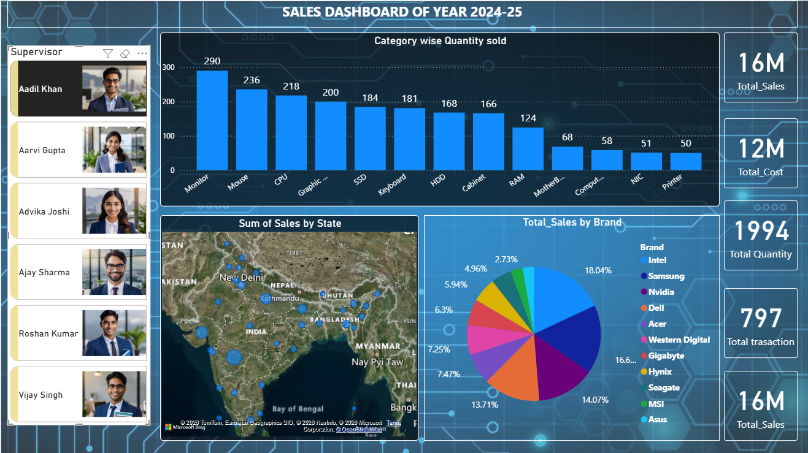

# Sales & Inventory Performance Dashboard

An interactive Power BI dashboard built to analyze sales, cost, and profit data across multiple product categories, brands, and regions — enabling data-driven business decisions.

## 🖼️ Dashboard Preview

## 🔍 Overview
This is a personal project created to practice end-to-end dashboard development in Power BI — from data cleaning to building an interactive, business-ready report.

## ⚙️ Tools & Technologies
- **Power BI** – Dashboard design & visualization
- **Power Query** – Data cleaning and transformation
- **DAX** – Calculated measures and KPIs

## ✨ Key Features
- Built an end-to-end interactive Power BI dashboard analyzing sales, cost, and profit data across multiple product categories and regions
- Visualized category-wise quantity sold and brand-wise market share (10+ brands) using bar charts and pie charts to identify top-performing products
- Created a geo-map visualization for state-wise profit distribution across India, along with KPI cards for Total Sales, Cost, Profit, and Transactions
- Added a supervisor-wise slicer to enable dynamic filtering of sales performance by individual team members
- Used Power Query for data cleaning/transformation and DAX for calculated measures to support quick decision-making

## 📈 Key Metrics Displayed
- Total Sales: 99M
- Total Cost: 76M
- Total Profit: 23M
- Total Transactions: 5,095
- Quantity Sold: 13K

## 📂 Files in this Repository
- `Sales_Dashboard.pbix` – Power BI project file
- `screenshot.png` – Dashboard preview image

## 🚀 How to View
1. Download the `fist_project.pbix` file
2. Open it in Power BI Desktop (free download from Microsoft)
3. Explore the interactive filters and visuals

## 📌 Learnings
This project helped me strengthen my skills in data cleaning, DAX calculations, and designing interactive, business-focused dashboards.
